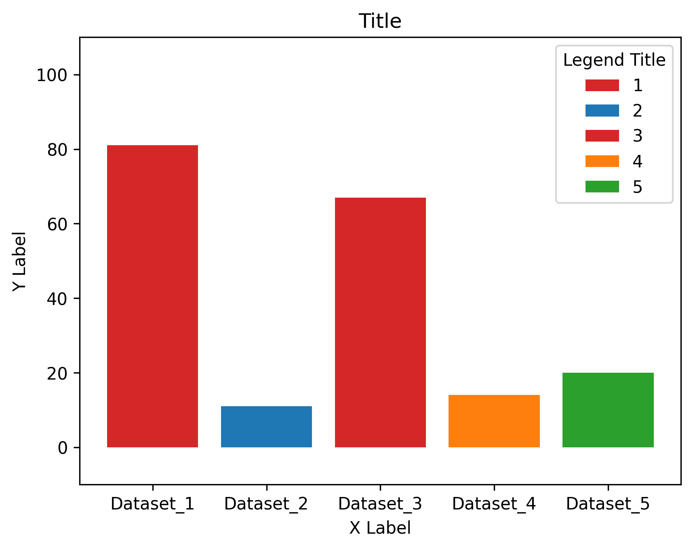
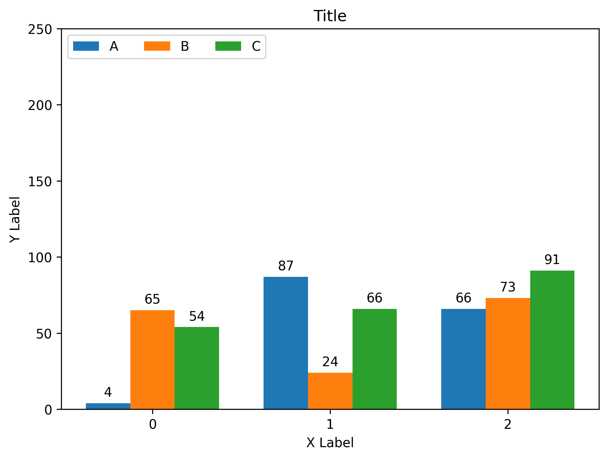
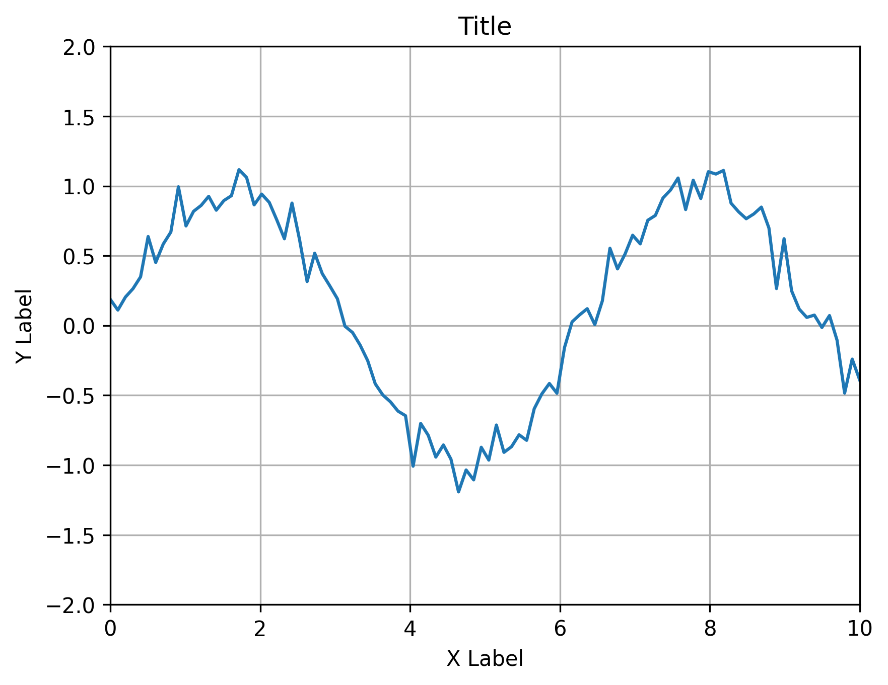
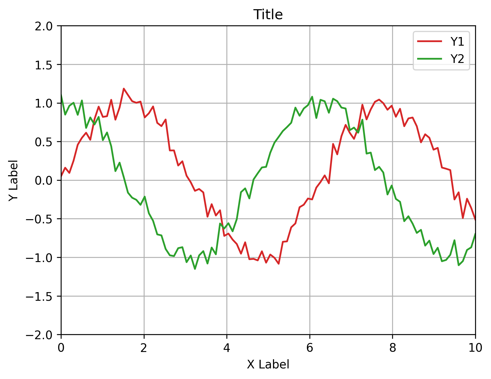
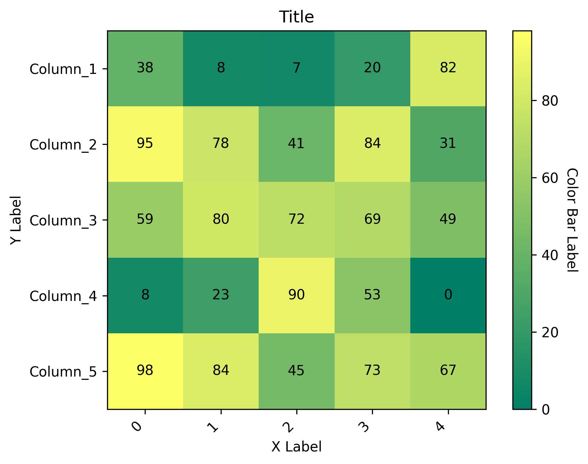
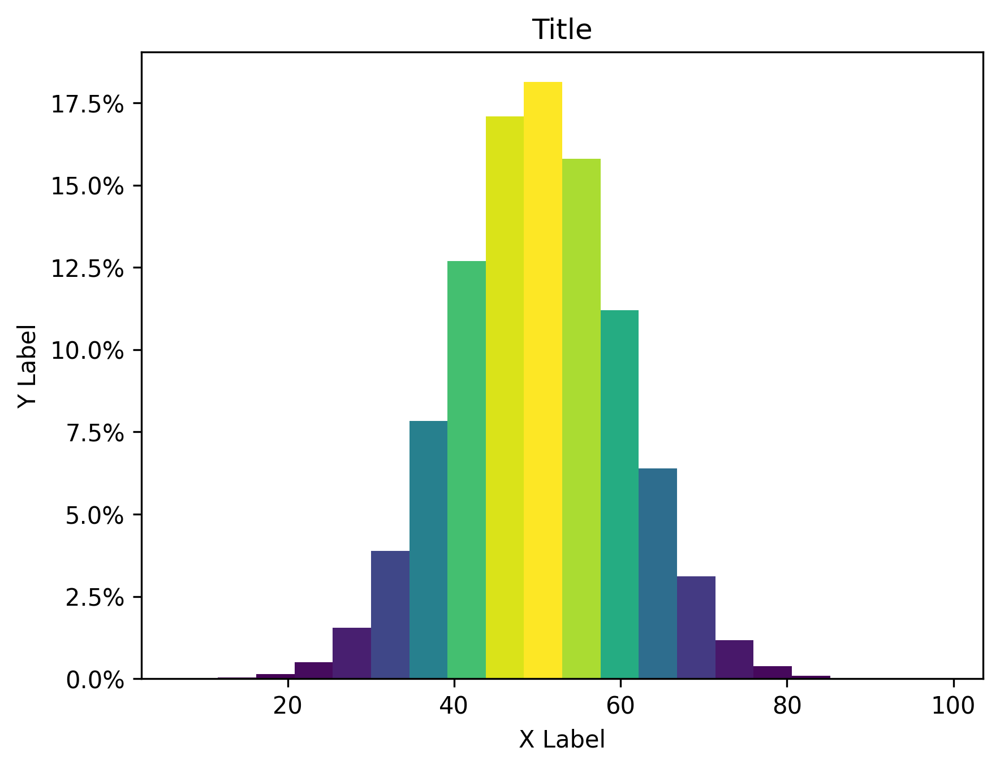
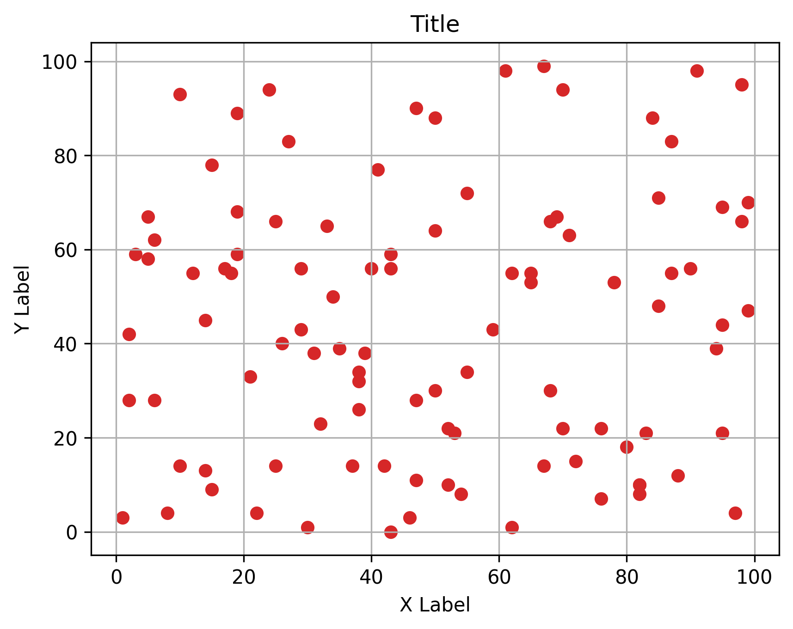
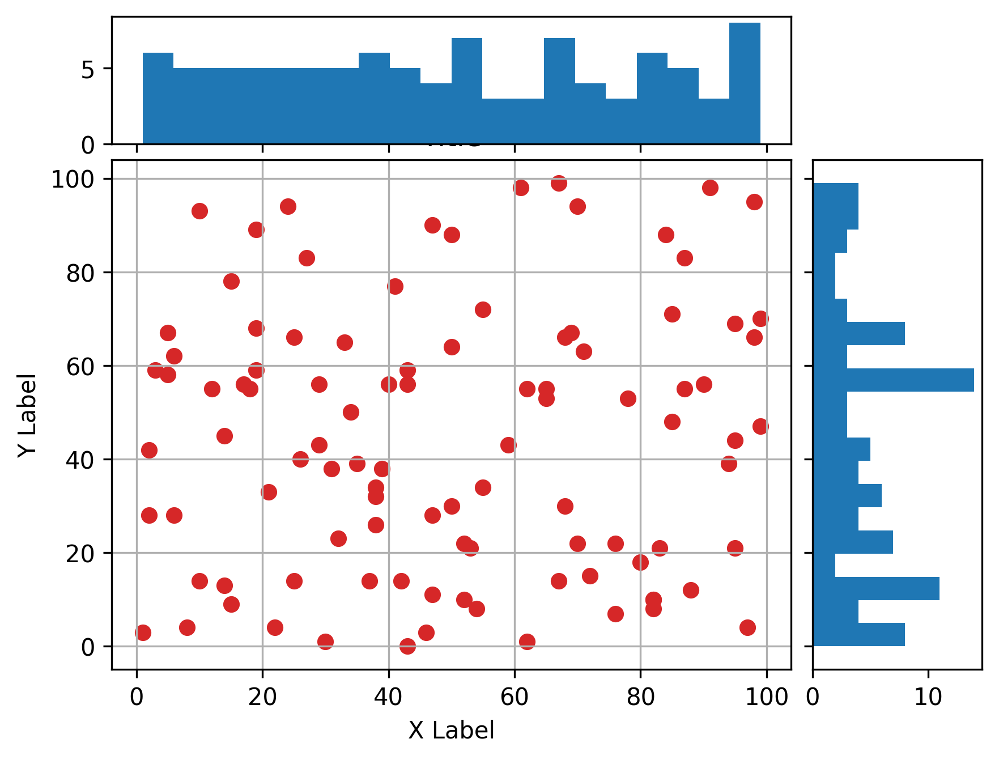
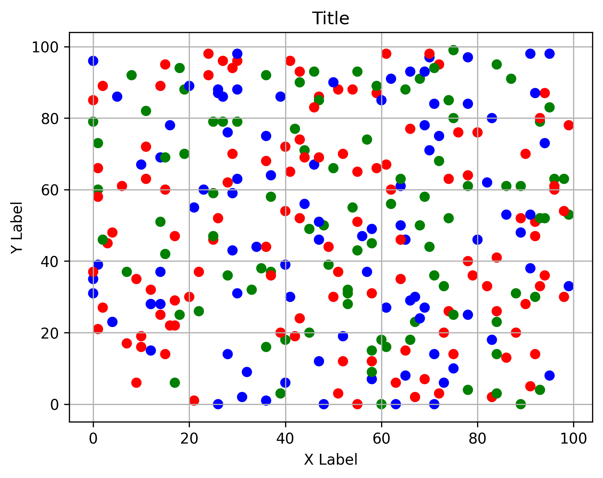

# Plotting Examples
본 레포지토리는 서울대학교 물리천문학부 학생회 <닻별>의 <물리천문학부를 위한 실험 가이드>를 위해 작성되었습니다.\
아래 그래프들은 Matplotlib을 이용하여 그린 그래프들입니다. \
모든 그래프는 [Matplotlib](https://matplotlib.org/)를 참조하여 그려졌습니다.

## Barplot

## Signal Plot

## Heatmap

## Histogram

## Scatter Plot

